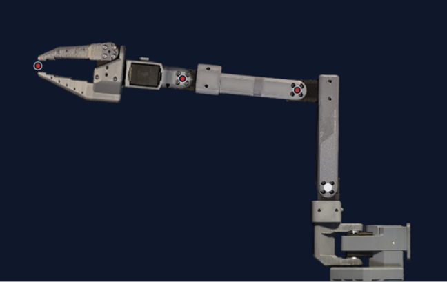
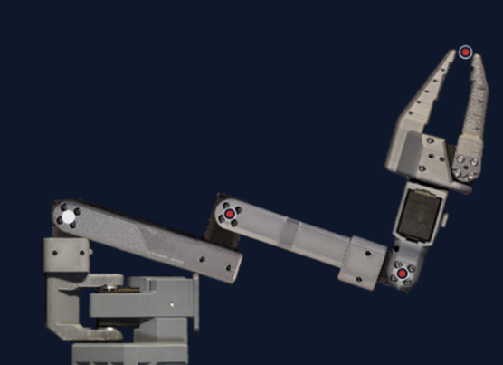
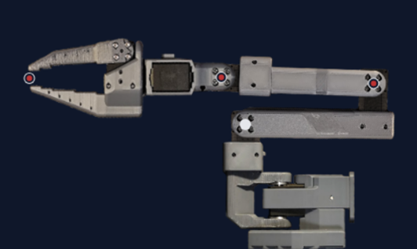
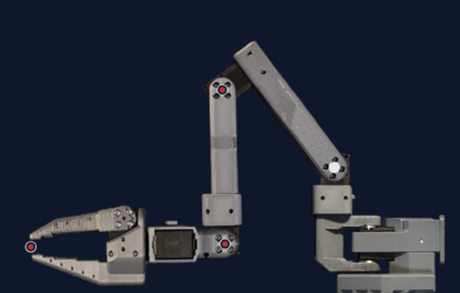
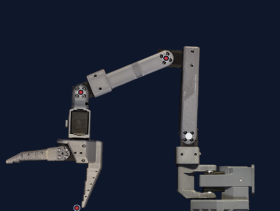
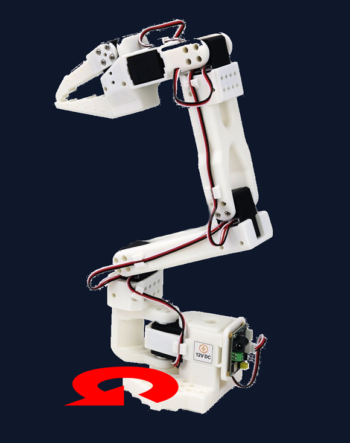
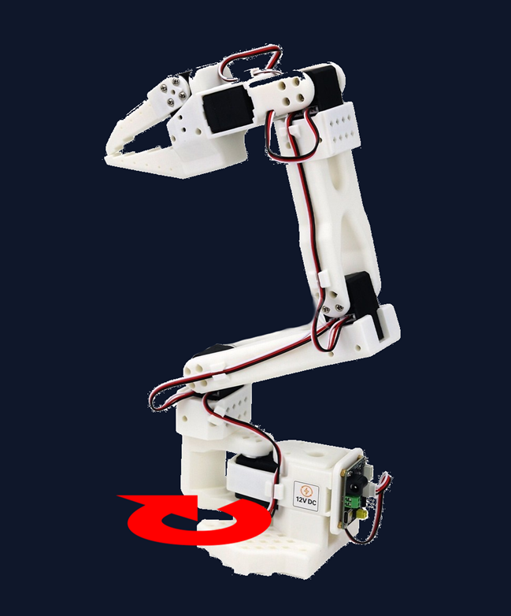

# Robot Joint Data Report

## Section 1

| Joint | Degrees | Range Value |
|---|---:|---:|
| shoulder_pan | +2.99° | -1 |
| shoulder_lift | -3.52° | 0 |
| elbow_flex | +1.94° | 0 |
| wrist_flex | +0.70° | 1 |
| wrist_roll | +3.43° | 0 |
| gripper | -0.62° | 1 |

---

## Section 2

| Joint | Degrees | Range Value |
|---|---:|---:|
| shoulder_pan | +2.90° | -1 |
| shoulder_lift | -107.85° | -99 |
| elbow_flex | -93.87° | -98 |
| wrist_flex | +101.25° | 98 |
| wrist_roll | +3.69° | 0 |
| gripper | -0.62° | 1 |

---

## Section 3

| Joint | Degrees | Range Value |
|---|---:|---:|
| shoulder_pan | +3.17° | 0 |
| shoulder_lift | -91.59° | -84 |
| elbow_flex | +100.20° | 99 |
| wrist_flex | +2.37° | 3 |
| wrist_roll | +3.60° | 0 |
| gripper | -0.53° | 1 |

---

## Section 4

| Joint | Degrees | Range Value |
|---|---:|---:|
| shoulder_pan | +3.25° | 0 |
| shoulder_lift | +46.49° | 47 |
| elbow_flex | +50.80° | 49 |
| wrist_flex | -86.75° | -83 |
| wrist_roll | +3.25° | 0 |
| gripper | -0.62° | 1 |

---

## Section 5

| Joint | Degrees | Range Value |
|---|---:|---:|
| shoulder_pan | +2.99° | -1 |
| shoulder_lift | +1.67° | 4 |
| elbow_flex | +37.27° | 35 |
| wrist_flex | +55.37° | 54 |
| wrist_roll | +3.52° | 0 |
| gripper | +98.00° | 75 |

---

## Section 6

> Facing to the **LEFT** by 90 degrees (Towards me)

| Joint | Degrees | Range Value |
|---|---:|---:|
| **shoulder_pan** | **-90.79°** | **-79** |
| shoulder_lift | -58.36° | -52 |
| elbow_flex | -20.74° | -24 |
| wrist_flex | +100.89° | 98 |
| wrist_roll | +3.52° | 0 |
| gripper | -0.97° | 1 |

---

## Section 7

> Facing to the **RIGHT** by 45 degrees (Away from me)

| Joint | Degrees | Range Value |
|---|---:|---:|
| **shoulder_pan** | **+46.49°** | **35** |
| shoulder_lift | -58.45° | -52 |
| elbow_flex | -20.74° | -24 |
| wrist_flex | +100.98° | 98 |
| wrist_roll | +3.52° | 0 |
| gripper | -0.97° | 1 |
